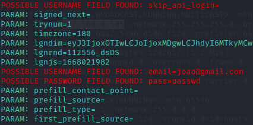

# Phishing para captura de senhas do Facebook
## Ferramentas
 - <kbd> Kali Linux
 - <kbd> setoolkit

## Configurando o Phishing no Kali Linux
- Acesso root: <kbd>sudo su </kbd>
- Iniciando o setoolkit: <kbd>setoolkit
- Tipo de ataque: <kbd>Social-Engineering Attacks
- Vetor de ataque: <kbd>Web Site Attack Vectors
- M étodo de ataque: <kbd>Credential Harvester Attack Method 
- Método de ataque: <kbd> Site Cloner
- Obtendo o endereço da máquina: <kbd>ifconfig</kbd> ou <kbd>ip addr</kbd>
- URL para clone: http://www.facebook.com

### Imagem de uma captura:
